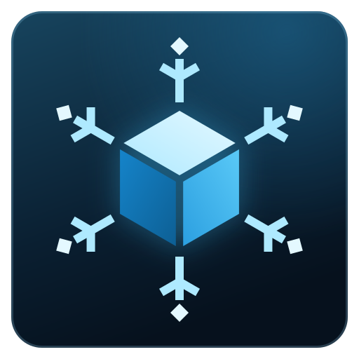

# nsl — WSL-style Linux machines for atomic Linux

**Keep the host atomic. Work in any distro.**

An atomic Linux host keeps its base system read-only and replaceable. You still need somewhere to `apt install` a project's dependencies, try a toolchain packaged for another distro, or run a service. nsl gives you persistent Linux machines for that work, as WSL does on Windows. Each machine is a whole distro with its own packages and services. It opens in the directory you were in, works on your files, and stops when you stop using it.

```sh
nsl create debian --distro debian:13   # verify and cache the signed images; the first machine is the default
nsl                                    # a login shell in the machine, in this directory
nsl run make test                      # one command, with its exit status
```

**Documentation: [frostyard.github.io/nsl](https://frostyard.github.io/nsl/)**

## What you get

- **Seven signed distros.** Debian 13, Ubuntu 26.04 LTS, Fedora 44, CentOS Stream 10, Arch, and openSUSE Tumbleweed and Leap 16.0, rebuilt weekly and verified against the Frostyard publishing workflow before use. [Machine images →](https://frostyard.github.io/nsl/reference/machine-images/)
- **Your files and your account.** Your home, removable media and `/mnt` appear at `/mnt/host`, and you have your own username, UID and GID with passwordless `sudo`. [Host files →](https://frostyard.github.io/nsl/guides/host-files/)
- **Ports and windows on the host.** A server in a machine is reachable at the same port on host `127.0.0.1`, and Wayland applications open windows on your desktop. [Ports →](https://frostyard.github.io/nsl/guides/ports/) · [Desktop applications →](https://frostyard.github.io/nsl/guides/desktop/)
- **Your editor.** `nsl ssh-config` gives VS Code or any SSH client a host alias for a machine. [Editors over SSH →](https://frostyard.github.io/nsl/guides/editors/)
- **Isolation when you need it.** `--isolated` puts a machine in a VM of its own, with no host files, desktop or host actions, for software you do not trust. [Isolated machines →](https://frostyard.github.io/nsl/guides/isolated/)
- **Backups and moves.** Export a stopped machine to an archive, and import it later or on another host. [Export and import →](https://frostyard.github.io/nsl/guides/export-import/)
- **A host left alone.** nsl runs as your user, with no daemon of its own. It installs no host packages and changes no device permissions, groups or sudoers.

## How it works

Machines are systemd-nspawn containers inside one small VM, launched with systemd-vmspawn and QEMU/KVM. The VM's root is replaceable and holds no user state; your machines live on its data disk. [How nsl works →](https://frostyard.github.io/nsl/concepts/how-it-works/)

An ordinary machine is trusted as you: it can read and write your home, including keys and tokens, just as WSL can. It cannot become root on the host or reach host sockets. Use `--isolated` for anything you would not run as yourself. [Trust model →](https://frostyard.github.io/nsl/concepts/trust/)

## Is it for you?

nsl needs an x86-64 Linux host with KVM, systemd-vmspawn, QEMU with UEFI firmware, virtiofsd and membership in the `kvm` group; Waypipe adds desktop windows. `nsl doctor` checks each requirement. [Install →](https://frostyard.github.io/nsl/getting-started/install/)

It is **pre-release**. v0.4.0 was the first release of the current design; v0.3.0 and earlier are a retired prototype. The tested host is Snow Linux 13 with systemd 261.2, QEMU 10.0.13, virtiofsd 1.13.2 and GNOME Wayland. Windows are Wayland only, host file edits produce no inotify events in machines, and idle machines stop even when a service inside them is busy. [Limits and troubleshooting →](https://frostyard.github.io/nsl/reference/limits/)

## Start

1. [Install nsl](https://frostyard.github.io/nsl/getting-started/install/) with Homebrew (`brew tap frostyard/tap`, then `brew install --cask frostyard/tap/nsl`, available from the next stable release) or from the [latest release](https://github.com/frostyard/nsl/releases/latest).
2. [Create your first machine](https://frostyard.github.io/nsl/getting-started/first-machine/).
3. Look up [commands](https://frostyard.github.io/nsl/reference/cli/) and [configuration](https://frostyard.github.io/nsl/reference/configuration/) as you need them.

## Contributing

[Build from source](https://frostyard.github.io/nsl/contributing/build/) covers the CLI, the images and the tests; `make ci` runs what CI runs. Decisions, designs, contracts and plans start at the [documentation index](docs/README.md), and agents start at [AGENTS.md](AGENTS.md).

nsl is [MIT licensed](LICENSE). [Third-party license notices](THIRD_PARTY_NOTICES.txt).

## Credits and Inspiration

Obviously the original [WSL](https://wsl.dev/) is the biggest inspiration.

Other notable projects:

- [nspawn.org](https://nspawn.org) which recently re-launched and gave me the idea
- [systemd](https://systemd.io) does nearly all the heavy lifting with systemd-vmspawn and systemd-nspawn
- [lima](https://github.com/lima-vm/lima) an early pioneer in this space with a slightly different intended use
