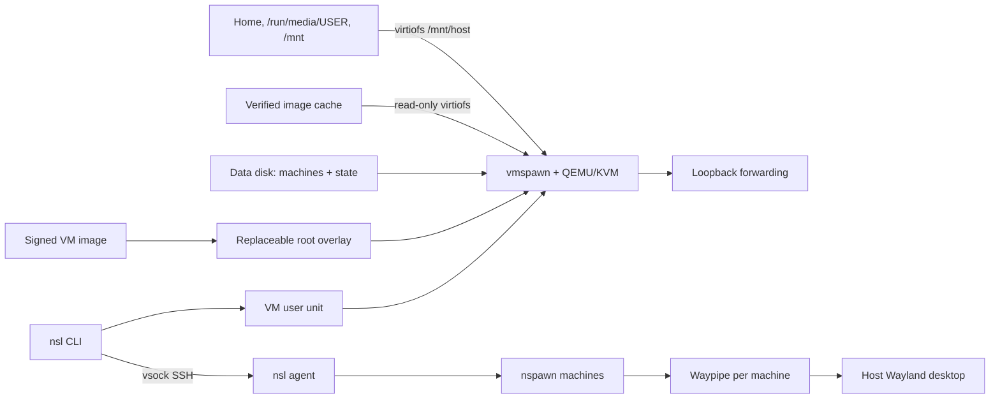

# Machine lifecycle and host integration

Living document for the design that [ADR-0016](../adr/0016-wsl-style-machines.md) and [ADR-0017](../adr/0017-shared-vm-and-machine-images.md) set. Contract: the [CLI spec](../specs/cli.md). The [implementation plan](../plans/shared-vm-implementation.md) records which parts are live; the binary runs the VM; machines arrive with Phases 6 and 7.

## Overview

nsl runs one VM per state directory, the shared VM, and one more for each isolated machine. Each VM boots the [nsl VM image](../specs/vm-image.md) through systemd-vmspawn and QEMU under a systemd user unit. Machines are systemd-nspawn containers on the VM's data disk, created from signed [machine images](../specs/machine-images.md). SSH over vsock reaches the [agent](../specs/agent.md), which runs commands in machines and manages them. A forwarder per VM carries machine ports to host loopback, and a Waypipe session per machine carries its windows.

## State and ownership

`NSL_HOME` defaults to `$XDG_DATA_HOME/nsl` or `~/.local/share/nsl`. Settings live apart from state, in [`nsl.conf`](../specs/cli.md#configuration).

| Path | Content |
| --- | --- |
| `vm/` | The shared VM: its record, root overlay, data disk, SSH keypair, pinned host key, SSH configuration and boot credential. |
| `isolated/NAME/` | The same for isolated machine NAME's VM. |
| `machines/NAME.json` | A machine record: ID, trust tier, account, image build and digest. |
| `default` | The default machine's name, when there is one. |
| `removing/NAME` | A machine whose removal is in progress; the name stays reserved. |
| `images/`, `delivery/` | The verified image cache and authenticated catalogue history. |

A VM record holds the VM's ID, owner, UID and GID, the image build its root overlay came from and any pending image, the memory and CPUs in effect, and the data disk's committed and pending capacity. Runtime sockets live under `/run/user/UID/nsl/ID`, so long state paths do not lengthen socket names.

Ownership, file type and permissions are checked before any change. The VM ID yields its unit names and a stable vsock CID, and creation avoids CIDs used by other VMs in the same state directory. Launch refuses a CID that already answers. Unit descriptions must name the ID before nsl controls a unit.

A manager lock serializes image import, name allocation and the default. Per-VM and per-machine locks serialize lifecycle changes, and commands release them after readiness so sessions run concurrently. A call that waited for a lock reloads the record and rejects a changed ID. Atomic writes separate prepared state from interrupted preparation. nsl never adopts or replaces an existing name, image, disk or archive.

## The VM

The root is a qcow2 overlay on a cached, verified VM image. It holds no user state. `nsl update` records a pending image, and the next start discards the overlay and creates a new one from that image. The data disk is a separate qcow2 whose btrfs filesystem holds the machines and a state subvolume. That subvolume keeps the VM's binding, SSH host keys and machine records, so a new root keeps the pinned host key and every machine.

vmspawn passes the `nsl.vm` credential: the VM ID, role, host UID and GID, public key, autostart setting, shares and aliases. On first boot the VM formats a blank data disk and records the binding. On later boots it rejects a credential that differs, and it grows the data filesystem to the disk before readiness.

Resources come from the configuration when the VM starts, and the record keeps what is in effect. When the file differs, `config` and `list` report a pending restart.

## Launch and readiness

The user needs KVM and vhost-vsock access through the `kvm` group. A fixed internal command opens the devices under that group, restores the account's primary group, and enters an unprivileged user namespace that maps the user's UID and GID to themselves. It verifies the devices and passes them to vmspawn as named file descriptors. Capabilities stay scoped to that namespace. nsl changes no host permissions, groups, packages or sudoers.

The unit `nsl-UID-vm-ID.service` runs vmspawn with the root overlay, the data disk as an extra drive, the virtiofs shares, the read-only image cache and the credential. A newly launched VM gets up to 90 seconds to become ready. Readiness is the agent's `identity` answer over authenticated vsock SSH. The host checks it for the VM's ID, UID, GID and role, and for the image descriptor's protocols and architecture, even when the unit was already running. Failures keep the disks and point to `logs` and `recover`. Forwarding starts only after readiness.

The shared VM starts on first use. At boot it starts every machine unless `autostart` is false. It stops when no machine is running, and `shutdown` stops it at once. A stop asks the VM to power off, waits up to 30 seconds, then stops the owned unit.

`recover` stops the owned runtime, completes pending growth, checks the data disk without repairing it, and starts the VM again from a fresh root overlay, since the root holds nothing that must survive. It keeps keys, pinned host keys and machines. It cannot rebuild deleted keys or repair a corrupt filesystem, and it is not a backup.

## Machines

`create` verifies a cached machine image and allocates a machine ID and record under the manager lock. The agent then imports the root filesystem from the read-only cache into a staging subvolume and applies per-machine data:

- the host time-zone link, before anything runs in the tree;
- hostname and hosts entry;
- the account, with the host username, UID and primary GID;
- the `sudo` rule;
- the VM-side record from which nspawn settings are generated.

It publishes the subvolume under the machine's name only after every step succeeds. A failure deletes the staging subvolume and leaves the name free. The first machine becomes the default.

Machines run with `PrivateUsers=no` in the VM's network namespace with its resolver and, in the shared VM, bind `/mnt/host`. Machine root is effectively VM root, so machines are not isolated from one another. `start` waits for the machine's manager to report `running` or `degraded`. An idle monitor in the VM stops a machine after `idle_timeout` without `nsl-run-*` sessions or Waypipe clients.

An isolated machine gets its own VM from the same image, with the `isolated` role, no shares, no display session and `[isolated]` resources.

## Commands and files

The host translates the working directory by the device and inode of its ancestors against the shared trees, including bind-mount aliases. A shell falls back to the guest home; `run` fails instead. The agent runs argv as a transient unit in the machine through systemd's D-Bus API: literally, with a PAM session through the image's `nsl` service, and with separate or PTY streams. Signal deaths return 128+N.

Machines that are not isolated see the user's home, `/run/media/USER` and `/mnt` at `/mnt/host`, read-write through virtiofs, with relative symlinks for top-level aliases such as `/mnt/host/home → var/home`. virtiofsd runs as the host user, so guest root cannot exceed the host user's permissions. Unix sockets do not connect across the share. Host edits produce no inotify events in machines, so watched builds belong in the guest home. Edits between machines do produce events, because they share a kernel.

## Storage

`remove --yes` requires a stopped machine and the manager and machine locks. It renames the record into `removing/NAME`, and the agent deletes the subvolume and VM-side record. The host record goes last, so a repeated command resumes.

`resize --disk` grows a stopped VM's data disk. It records the target before invoking `qemu-img`, then syncs and verifies the disk and commits the new capacity. `recover` or a repeated resize completes interrupted growth. The VM grows the filesystem at its next boot, and shrinking is unsupported. See [ADR-0008](../adr/0008-offline-storage-management.md).

## Export and import

[ADR-0006](../adr/0006-stopped-vm-backups.md) defines machine archives. `export` locks a stopped machine, and the agent streams its root filesystem as a zstd tar with numeric owners, xattrs and ACLs. The host writes it with a checksummed manifest to private staging, then publishes the archive with a hard link that refuses an existing path. `import` validates the manifest and checksums in staging. The agent then extracts into a staging subvolume, refusing unsafe entries, applies per-machine data for the new name, and publishes. The trust tier comes from the import flags.

## Networking

vmspawn's user-mode networking supplies outbound access. A forwarder unit per VM discovers IPv4 TCP listeners in the VM, which include every machine's, once per second. It keeps an SSH forwarding connection and binds each port 1024–65535, except 5353 and 5355, on host `127.0.0.1`. A failed bind is reported by `ports` and retried, and never displaces an existing listener. Machines share the VM's namespace, so one port serves one machine at a time, as in WSL.

## Desktop and host actions

Each machine that is not isolated gets one persistent Waypipe session. It runs `waypipe server` in the VM on a display socket under `/run/nsl/wayland/`, and the socket's directory is bound into the running machine. Agent sessions receive `WAYLAND_DISPLAY`. The per-machine broker behind `nsl-open` accepts only `http`/`https` URLs and translatable `/mnt/host` paths.

## Images

`images`, `pull`, `create --distro` and `update` follow the [signed delivery contract](../specs/image-delivery.md). The CLI verifies the catalogue and each descriptor against the embedded Sigstore root and the exact Frostyard workflow identity. It downloads by immutable digest, validates resumed bytes, and bounds decompression before publishing into the cache. Offline use requires fresh metadata and a complete verified cache.

## References

- Rationale: [ADR-0016](../adr/0016-wsl-style-machines.md), [ADR-0017](../adr/0017-shared-vm-and-machine-images.md), [ADR-0005](../adr/0005-vmspawn-and-nspawn-images.md), [ADR-0006](../adr/0006-stopped-vm-backups.md), [ADR-0008](../adr/0008-offline-storage-management.md).
- Contracts: [CLI](../specs/cli.md), [agent](../specs/agent.md), [VM image](../specs/vm-image.md), [machine images](../specs/machine-images.md), [image delivery](../specs/image-delivery.md).
- Evidence: [shared-VM experiment](../plans/shared-vm-experiment.md).
