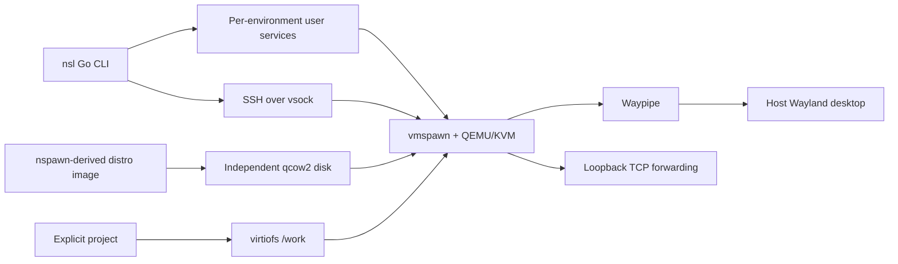

# VM lifecycle and host integration

Living document. Rationale: [ADR-0005](../adr/0005-vmspawn-and-nspawn-images.md). Contract: [CLI spec](../specs/cli.md).

## Overview

Each environment is a full distro VM with its own kernel and persistent disk. The Go CLI manages systemd user services that launch systemd-vmspawn/QEMU. SSH over vsock carries commands, terminal sessions and Waypipe. A second service discovers IPv4 TCP listeners and forwards them to host loopback.

## State and ownership

`NSL_HOME` defaults to `$XDG_DATA_HOME/nsl` or `~/.local/share/nsl`. `environments/NAME` holds schema-2 metadata, an independent `disk.qcow2`, an SSH keypair, boot credential, SSH config, pinned host key and forwarding status. Imported raw images are stored by SHA256 under `images/`. Runtime sockets live under `/run/user/UID/nsl/ID`, so long state paths do not extend socket names.

Ownership, file type and permissions are checked before state changes. Metadata identity and resource limits are validated. The environment ID generates unique unit names and a stable vsock CID; creation avoids CID collisions with other environments in the same state directory. QEMU rejects an already occupied CID outside that directory. Unit descriptions must match the environment ID before nsl controls them.

A manager lock serializes image import and name allocation. Per-environment locks serialize preparation, startup, stop and recovery. Commands release the lock after readiness so sessions can run concurrently. Atomic metadata writes distinguish prepared state from interrupted preparation. Existing names, images and disks are never silently adopted or replaced. Old experimental state uses another schema and remains untouched.

## Image and first boot

The [image build](../../image/README.md) combines pinned nspawn disk recipes with common integration, family boot adapters and seven explicit distribution profiles. Lima is an optional build tool only. The runtime requires an explicit local raw image and SHA256. nsl verifies an imported copy, then converts it to an independent qcow2 disk and enlarges its virtual capacity. Existing environments do not depend on the cached raw image after conversion.

Image v4 keeps `/boot` on btrfs and mounts a 1 GiB EFI partition at `/efi`. Debian package hooks use `systemd-ukify` and the UKI layout; first boot records the root UUID for later initramfs-tools boots without replacing administrator settings. Image v6 uses an nsl-owned vsock socket and inetd-style OpenSSH unit that require successful setup. The guest SSH generator is masked to prevent duplicate listeners. Older images still use the CLI's explicit listener kernel arguments. [ADR-0011](../adr/0011-image-profiles-and-portable-vsock.md). [ADR-0007](../adr/0007-maintainable-guest-boot.md). Existing v3 disks retain their earlier layout and require an explicit migration before kernel maintenance.

The generic image contains no fixed development account or client key. vmspawn supplies a boot credential containing the environment ID, host UID/primary GID and public SSH key. The guest's `nsl-setup.service` validates the credential and configures the `nsl` account, home and guest sudo. It records the binding on disk and rejects a different identity on subsequent boots. Setup is idempotent, recovers partial account/home creation and preserves later authorized-key additions. Guest setup syncs its changes; first-use readiness also flushes guest storage before recording initialization, including generated SSH host keys. Client private keys remain on the host; The common setup helper generates guest host keys at first boot.

`systemd-repart` grows the root partition; root growth supports btrfs on Debian and ext4 on Ubuntu to the virtual disk capacity. The guest image includes the Debian `systemd-repart` package explicitly. This step is independent of account setup. Debian v5 explicitly makes setup require `systemd-growfs-root.service` after repart/remount; kernel regeneration can bypass the automatic root discovery that previously scheduled this service. Earlier v4 guests need an explicit integration update. See [ADR-0010](../adr/0010-explicit-guest-root-growth.md).

## Launch and readiness

The user must already have KVM/vhost-vsock access through `kvm`. A fixed internal command opens the devices under that group, restores the account's primary group, and enters an unprivileged user namespace mapping the normal UID/GID to themselves. It verifies and passes the devices through vmspawn's named file descriptors. Capabilities are scoped to that user namespace. nsl changes no host permissions, groups, packages or sudoers.

Every `start`, `exec`, `shell`, `gui` or `ssh-config` checks authenticated guest identity, including when a unit is already running. A newly launched VM gets up to 90 seconds to become ready. Readiness validates the guest environment ID, UID, GID and protocol. Failures preserve the disk and point to `logs` and `recover`. Forwarding is started or restored only after readiness succeeds.

`stop` first stops the forwarding service, requests guest shutdown, waits up to 30 seconds and falls back to stopping the owned unit. The unit's stop timeout bounds forced teardown. Command SSH multiplexers are closed afterward. Disks and configuration persist. Shell exit leaves the VM running.

`recover` stops the owned runtime, resumes missing preparation artifacts, checks an existing qcow2 disk without automatic repair, and starts it again. It preserves keys, pinned host trust and existing disk contents. It cannot reconstruct deleted keys, repair filesystem corruption or recover an orphan directory lacking valid metadata. Recovery is not backup/restore.

## Offline storage changes

`remove` previews deletion; `--yes` requires both owned units stopped. Manager and environment locks protect a rename into `removing/NAME`. Deletion preserves metadata until the final step so it can resume safely; name reuse remains blocked until the tombstone is gone. External projects, cached images and backups survive. Lifecycle calls reload metadata after acquiring the lock and reject replacement IDs.

`resize --disk GiB` records `resize_target_gib` before growing a stopped qcow2 disk, syncs and verifies the disk, then commits `disk_gib` and clears the target. Recovery accepts either the old or target capacity; other capacities fail inspection. Start/export refuse pending growth; `recover` or a repeated resize completes it. Guest root growth happens on boot. Shrinking is unsupported. [Storage decision](../adr/0008-offline-storage-management.md), [validation](../plans/storage-management.md).

## Backup and restore

[ADR-0006](../adr/0006-stopped-vm-backups.md) defines whole-system backups. `export` locks a stopped environment, checks the standalone qcow2 disk and compacts it into private staging. A version-1 tar archive carries a bounded manifest, hashes/sizes, disk, client keypair and optional pinned trust. Atomic hard-link publication refuses an existing destination. Shared project files remain on the host and are excluded. Archives are unencrypted and include credentials.

`restore` validates and extracts only the allowed regular files into a private temporary directory. Before QEMU sees the disk, nsl checks its header for external references, invalid geometry, dirty/corrupt flags and unsupported features; QEMU then checks disk metadata. The client keypair is checked with `ssh-keygen`. No arbitrary saved host config or paths are imported. Verified state is published under the manager lock, then normal preparation writes boot and SSH configuration. An interrupted final preparation can be resumed with `recover`.

Schema-2 metadata has an optional `guest_id`: fresh environments use their runtime `id` as the guest binding; restored environments keep the backed-up binding and get a fresh runtime `id`. Readiness, boot credentials and SSH host-key aliases use the guest binding; units, sockets and CIDs use runtime identity. Restored copies preserve machine ID and SSH identities, so they are not independently authenticated clones. Version 1 requires matching UID/primary GID. Project sharing and desktop opt-in must be selected again. The independent restored disk does not need the base-image cache.

The [backup milestone](../plans/backup-and-reliability.md) and [storage milestone](../plans/storage-management.md) record acceptance results. The [distribution plan](../plans/distribution-support.md) moves package, boot and filesystem differences into image adapters under a common [guest contract](../specs/guest-images.md); all seven profiles use the shared acceptance suite, with separate [Debian/Ubuntu](../plans/image-profiles-and-ubuntu.md), [RPM](../plans/rpm-guests.md) and [SUSE/Arch](../plans/suse-and-arch.md) reports.

## Commands, files and GUI

Local tools receive argv arrays. A bounded base64 JSON request transports guest argv and an optional absolute working directory. The guest Python helper validates the request, sets the user's home/environment and calls `os.execvp`. Commands retain binary streams and exit status; SSH carries terminal sizing. Guest root is selected explicitly with `exec --root`.

Only an explicitly selected project is shared at `/work`, fixed at creation. The guest user matches host numeric UID/primary GID; supplementary groups are not copied. No host home, session bus, agent or GPU is implicitly shared. Polling or guest-native source files are required for live reload because host inotify events do not cross the tested virtiofs boundary.

GUI requires `--desktop` and an active host Wayland session. Waypipe software rendering carries individual windows over the same authenticated transport. The GUI remains attached until it exits. Clipboard, audio, GPU acceleration, portals and launcher export remain future work.

## Networking

User-mode networking supplies outbound access. A service tied to each VM polls guest IPv4 TCP listeners once per second and maintains a separate SSH forwarding connection. It forwards ports 1024–65535 to `127.0.0.1`, excluding 5353/5355. IPv6-only listeners and UDP are not implemented.

A failed host bind is reported by `ports`, retried on subsequent polls and never displaces the existing listener. Disappearing guest listeners cancel their forwards. A lost SSH master resets the inventory and reconnects. The forwarding service's lifetime is tied to its VM; `start` can restore a missing service. Port reports carry timestamps and errors, and `logs` shows both units. `NSL_DEBUG=1` on startup additionally forwards the guest journal to the VM console for early-boot diagnosis.

## Release gates

The tested target is Snow Linux, x86_64, systemd 261. Another atomic distribution, host reboot/suspend, newer-kernel upgrades beyond Arch, signed image delivery and broader desktop integration remain release gates; backup round trips, kernel reinstallation and rootless Podman passed across seven profiles, and Arch passed a kernel-version upgrade. Results are recorded in the [distribution matrix](../plans/distribution-support.md) and its linked acceptance reports. See the [implementation report](../plans/vmspawn-implementation.md) for exact validation and remaining work.

## Planned provisioning lifecycle

The proposed [cloud-init interface](../specs/provisioning.md) adds a separate provisioning state alongside VM readiness. User configuration is snapshotted at creation and executes on first boot through a local NoCloud seed; management access remains independent of completion. A dedicated persistent provisioning ID, input and guest execution markers survive restore even though runtime identity changes. Versioned archive support and per-image module/boot-order tests are required before enabling the feature. This is planned behavior under [ADR-0013](../adr/0013-optional-cloud-init-provisioning.md); see the [implementation plan](../plans/cloud-init-provisioning.md).

## References

- [ADR-0005](../adr/0005-vmspawn-and-nspawn-images.md), [CLI contract](../specs/cli.md).
- [Comparison experiment](../plans/vmspawn-comparison.md), [roadmap](../plans/wsl2-equivalent.md).

## Signed base selection

`images`, `pull` and `create --distro` use the [signed delivery contract](../specs/image-delivery.md).
The CLI verifies the catalogue and image descriptor against the embedded Sigstore
root and exact Frostyard workflow identity. It stores authenticated catalogue
history under `delivery/`, downloads by immutable digest, validates resumed bytes,
and bounds decompression before publishing a raw image into `images/`. Existing
local imports and downloads share the manager lock for final cache publication.
Per-artifact locks serialize transfers. Readiness checks the authenticated guest's
image descriptor as well as the per-environment identity.

A final check of locally authenticated catalogue state rejects an expired or
concurrently withdrawn selection before a pull returns. A catalogue refresh that
occurs after this decision applies to later selections. Explicit offline use
requires fresh metadata, a signed receipt, evidence files and a rehashed raw image.
Public image publication is pending; the local-image path remains usable.
