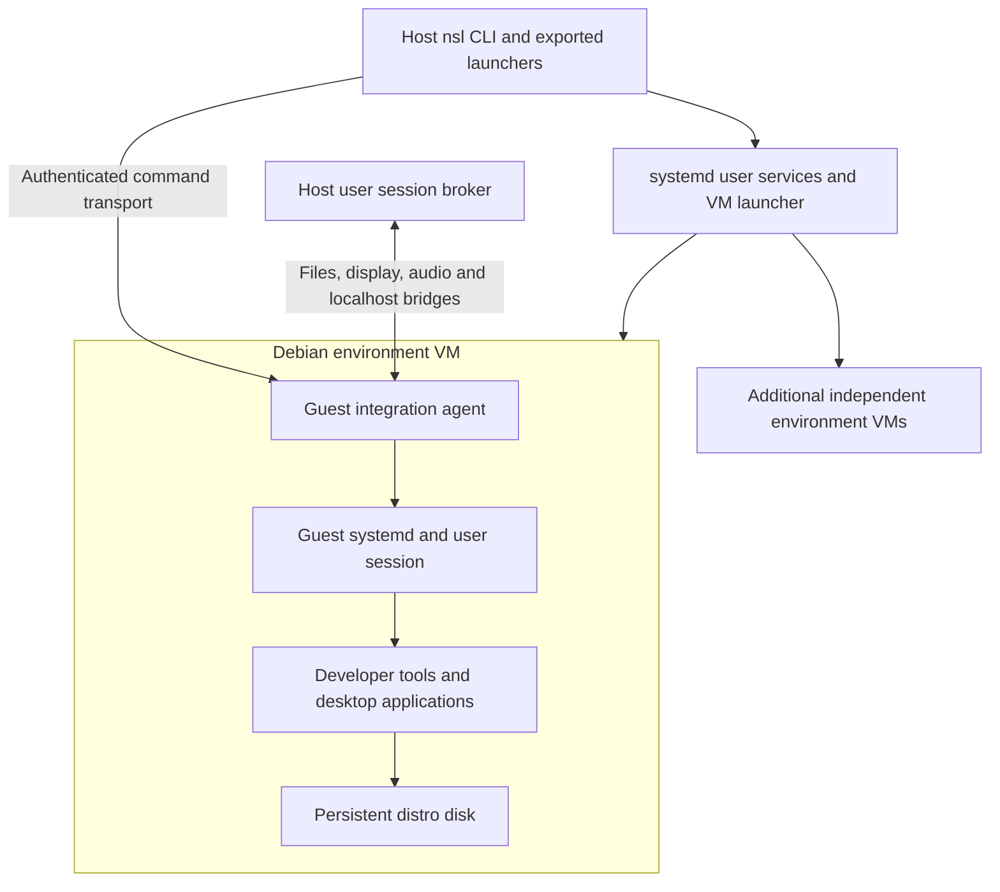

# Plan: WSL2-like environments on atomic Linux

Deliver persistent Linux VMs that open from a terminal or application launcher, use the user's projects and desktop, and require little routine VM administration.

**Status: working vmspawn prototype, 2026-09-26.** The Go CLI manages one full distro VM per environment through systemd-vmspawn/QEMU/KVM. Images use pinned nspawn mkosi disk recipes. Lima supplies the disposable image builder and remains a historical runtime baseline. No nspawn container runs inside the development VM. Decisions: [ADR-0005](../adr/0005-vmspawn-and-nspawn-images.md); current behavior: [lifecycle](../design/lifecycle.md), [CLI](../specs/cli.md).

## Current evidence and next work

On Snow Linux 13 x86_64, the current runtime passed two-VM isolation, disk growth, forwarding conflicts, controlled forced-exit recovery, guest build/test, PTY and basic Wayland checks. Warm commands passed 50/50 (median 63.37 ms); cold starts passed 20/20 (median 7.44 s, p95 7.94 s). Polling-based edit/build/HTTP reload took 0.416 s in one trial. Native host-to-guest inotify remains unavailable. These are one-host observations, not a support matrix. [Exact results and limits](vmspawn-implementation.md).

The next increment added stopped-VM export/restore and tested independent recovery with no image cache. A kernel reinstall exposed a v3 boot-layout defect; image v4 fixes it and passed regenerated-kernel boots plus a rootless Podman build/network/volume workflow. An actual newer-kernel upgrade is still untested. [Backup and maintenance results](backup-and-reliability.md).

The storage increment added explicit removal and resumable offline growth. A maintained v4 guest exposed a missing filesystem-growth service; v5 fixes it and passed an exact 8 GiB root increase plus a grown-disk backup/restore and peer-safe removal. [Storage results](storage-management.md).

Priority order:

1. **Protect guest work:** export/restore, safe removal and resumable offline growth are implemented. [Storage acceptance](storage-management.md).
2. **Support distro choice early:** common guest contract and separate image adapters; Debian/Ubuntu profiles and common acceptance implemented; Fedora next, then CentOS Stream and openSUSE Leap/Tumbleweed. Research SUSE Enterprise separately. [Plan and matrix](distribution-support.md).
3. **Prove daily reliability:** kernel reinstallation and rootless Podman passed; next test newer-kernel upgrades, host reboot/suspend, network changes, disk-full behavior and another atomic host.
4. **Reduce routine commands:** default environment, host cwd mapping, editor setup and selected command exports.
5. **Make installation practical:** signed prebuilt VM disks on GHCR, a signed catalogue, verified resumable downloads and a digest-addressed cache; versioned dependencies, protocol/update policy, Snow plus Fedora Atomic validation. [Image delivery plan](image-distribution.md).
6. **Complete desktop workflows:** application launchers, visual/input checks, clipboard, audio, portals and measured GPU support.

No release date is inferred from the prototype's development speed. Re-estimate each milestone after its acceptance checks. The user permits a complete rewrite, but the current Go implementation now has useful measured behavior; change language or runtime when it resolves a demonstrated problem. Unused historical guests were deleted with user authorization; the maintained validation guest and backup remain available.

## Research: what WSL2 actually supplies

Sources below are primary project documentation, accessed 2026-09-26. Rolling documentation can describe features newer than an installed package; pin versions during the prototype.

| WSL2 capability | Mechanism or behavior | Implication for nsl |
| --- | --- | --- |
| Real Linux kernel with little VM administration | A managed utility VM hosts isolated Linux distributions. | A container-only implementation cannot meet kernel independence. [Microsoft architecture comparison](https://learn.microsoft.com/en-us/windows/wsl/compare-versions) |
| Several distributions with shared overhead | User and GUI system distributions for a Windows user run in one VM against one kernel. Different Windows users have separate VMs. | Sharing a kernel saves overhead, but reproducing this topology is optional for the user experience. [WSLg architecture](https://github.com/microsoft/wslg#user-distro) |
| Simple machine lifecycle | Install/list/default selection, terminate/shutdown, import/export and runtime updates are normal CLI operations. | Users should select an environment, not configure a hypervisor for each shell. [WSL commands](https://learn.microsoft.com/en-us/windows/wsl/basic-commands) |
| Files and command interoperability | Host/guest command invocation, working-directory handling, explicit environment translation and file-manager access. Microsoft recommends keeping heavy Linux workloads on the Linux filesystem. | Support both shared host projects and guest-owned projects with remote editor access. [Files and interop](https://learn.microsoft.com/en-us/windows/wsl/filesystems) |
| Development networking | Default NAT with host access through localhost; optional mirrored networking adds capabilities including improved VPN compatibility. DNS tunneling and proxy integration address host networking changes. | Localhost servers, DNS, proxies and VPN transitions are separate requirements; NAT alone is insufficient. [WSL networking](https://learn.microsoft.com/en-us/windows/wsl/networking) |
| Individual desktop applications | WSLg integrates X11/Wayland apps, launcher entries, task switching and clipboard; its system distro supplies display/audio services and Weston remotes windows using RDP. | Build a Linux desktop integration layer; copying WSLg's Windows-specific host path is unnecessary. [GUI behavior](https://learn.microsoft.com/en-us/windows/wsl/tutorials/gui-apps), [WSLg implementation](https://github.com/microsoft/wslg#wslg-architecture-overview) |
| Resource and distribution settings | Global VM settings cover memory, processors and kernel; per-distro settings cover user, systemd and integration. Automatic cache reclamation is configurable. | Give each environment a VM budget and bound aggregate usage across VMs. [WSL configuration](https://learn.microsoft.com/en-us/windows/wsl/wsl-config) |

Aim for comparable workflows, not identical Windows mechanisms. A Linux host makes user identity and filesystem semantics easier, but a VM still separates kernels, file descriptors, network namespaces and desktop sessions.

## Historical transition from the container proof of concept

The baseline is commit `5490b28`: a Go CLI wrapping the nspawn.org client/service, signed Debian image metadata checks, owner labels, matching guest UID/GID, project and Wayland socket binds. Useful assets include the mockable runner, validation patterns, ownership checks and tests for command arguments.

The VM rewrite replaced command grammar, storage and lifecycle. The former mutually exclusive `enter`/`run`, `in` and `gui` mount modes are not a requirement. Nor are nspawn labels, host sudo, container image layout or the existing Debian-only bootstrap.

The user explicitly permits a complete rewrite, including language and dependency changes. The existing Go/standard-library convention is not a constraint on the successor. Choose the implementation after the launcher and reuse evaluation, then update AGENTS.md, build/release configuration and tests to match. Preserve useful behavioral invariants such as ownership checks and structured command arguments independently of language.

### What the previous nested design meant

It was host → VM → nspawn container → application. That is one hardware VM plus a container inside it, not two nested hardware VMs. Its real advantage is sharing one guest kernel and service infrastructure across many distributions, reducing repeated VM overhead. Its costs are a second mount/network boundary, container capability restrictions, shared-kernel failure domains and more integration machinery.

The new default is host → VM → application. Each environment gets its own kernel and persistent disk. Files, localhost forwarding, display transport and command execution cross one boundary. Users may install Docker or Podman inside their VM for their own workloads; nsl does not require another container around every environment.

Reconsider a shared utility VM only if measurements with several active environments establish a memory/startup problem that outweighs the added complexity.

## Reusing nspawn: images, recipes and code are separate choices

Research inspected nspawn source commit `3d54972674f08f1ac9fef38251b79a9cb4bbad03` and image definitions commit `68263d05169784f44168ca65241d989865ed011b`. Pin versions in the prototype; rolling docs can differ from the installed nspawn 1.5.1.

### Image route — recommended starting point

The image definitions' base configuration produces **OCI container images without a kernel or initrd** and sets `Bootable=no`. Their **disk profile** changes the output to a bootable disk and enables an initrd. The Debian disk overlay adds a kernel and systemd-boot. These are concrete upstream build assets, not a hypothetical OCI-to-VM conversion. [Base recipe](https://github.com/nspawn/mkosi-definitions/blob/68263d05169784f44168ca65241d989865ed011b/mkosi.conf), [disk profile](https://github.com/nspawn/mkosi-definitions/blob/68263d05169784f44168ca65241d989865ed011b/mkosi.profiles/disk/mkosi.conf), [Debian kernel profile](https://github.com/nspawn/mkosi-definitions/blob/68263d05169784f44168ca65241d989865ed011b/mkosi.profiles/disk/mkosi.conf.d/debian.conf).

Use those recipes with an nsl profile to build Debian VM images in CI. Add guest transport, user setup, networking, virtio support and desktop prerequisites. Override the recipe's default root password, generate unique machine/SSH identities at first boot, and validate architecture-specific packages: the reviewed Debian disk overlay names `linux-image-amd64`, so arm64 needs a separate entry. Build tooling belongs in CI or a disposable builder, not in the end user's atomic host.

Do not assume the hub publishes ready-made signed VM disks merely because the source can build them. The reviewed documentation describes signed OCI publication. nsl must arrange distribution, signatures, provenance and update ownership for its derived VM artifacts. [Upstream image build instructions](https://github.com/nspawn/mkosi-definitions/blob/68263d05169784f44168ca65241d989865ed011b/README.md).

Other image routes remain useful:

- **Official distro cloud/VM images:** compare one as a boot and provisioning baseline; use it if the recipe route adds avoidable maintenance.
- **Consume hub OCI images directly:** possible as an import/build pipeline, but requires verified layer extraction, OCI whiteout handling, filesystem metadata preservation, a kernel/modules/initrd/boot arrangement and first-boot configuration. The original signature authenticates the upstream artifact; publish provenance and a signature for the transformed artifact too. Do this only if importing the existing catalogue has clear product value. [Hub format and verification](https://nspawn.org/docs/images/).

### Runtime fork — viable, but evaluate the actual reuse

nspawn's architecture separates registry/auth/search, signature verification, OCI layout and storage from settings, namespace execution, volume mounts, bridge networking and systemd lifecycle. The former are plausible reuse candidates; the latter need VM-specific replacement. Its `backend` abstraction currently selects how container layers become a root directory, not which hypervisor runs the guest. A VM fork would therefore be more than adding a QEMU command to `start`. [Pinned architecture reference](https://github.com/nspawn/nspawn/blob/3d54972674f08f1ac9fef38251b79a9cb4bbad03/docs/ARCHITECTURE.md).

Compare a fork/extracted helper against external image tooling and a small nsl manager. Choose a fork only if its reusable image/service code saves more implementation and maintenance than retaining a broad container-oriented application costs. If selected, narrow its product scope deliberately rather than maintaining both runtimes without a user need. Record source licenses and notices for reused code/recipes; the repositories declare GPL-3.0 at their roots, while individual files may have their own SPDX identifiers. Keep that decision explicit alongside nsl's current MIT license. [nspawn license](https://github.com/nspawn/nspawn/blob/master/LICENSE), [recipe repository](https://github.com/nspawn/mkosi-definitions).

## Architecture and launcher choice

**Product recommendation:** a bespoke nsl experience on existing virtualization components. **Current prototype launcher:** systemd-vmspawn/QEMU, selected after the [comparison](vmspawn-comparison.md) and implemented in [the Go CLI](vmspawn-implementation.md). The earlier Lima implementation remains a measured baseline. Custom orchestration is justified only where it materially improves the Linux desktop experience, installation footprint or control over graphics/integration.

| Approach | Benefit | Cost / decision |
| --- | --- | --- |
| nsl + vmspawn/QEMU | Small Linux/systemd launch surface; direct distro VMs; available on the current host. | nsl supplies image management, transport and integration. Selected and implemented; lifecycle, transport, forwarding and basic GUI checks passed on Snow. |
| nsl + Lima/QEMU | Reuses launch, provisioning, SSH and forwarding. | Measured historical baseline; retained for image building, superseded as the development runtime. |
| Fork nspawn into a VM application | Potential reuse of registry, verification, service and image-management code. | Replace container execution/network/storage assumptions; broader scope and language/license decisions. Prototype reuse before selecting. |
| Direct QEMU/QMP under nsl | Maximum access to VM devices and graphics options. | nsl owns lifecycle/recovery details; use only if higher-level launchers block required behavior. |
| Incus/libvirt | Established VM management and storage. | Additional host-service/policy integration; good alternatives for preconfigured hosts, not simultaneous initial backends. |
| nspawn containers inside one VM | Share guest kernel and overhead across distributions. | Extra integration layer; revisit only on measured resource need. |
| Host-only Toolbx/Distrobox/nspawn | Useful desktop and developer workflow examples. | Shared host kernel; does not meet the VM requirement. |
| libkrun/muvm | Relevant lightweight VM and graphics work. | Evaluate graphics ideas; do not assume its host-program execution model covers persistent distro lifecycle. |

Sources: [vmspawn](https://github.com/systemd/systemd/blob/main/man/systemd-vmspawn.xml), [Lima architecture](https://lima-vm.io/docs/faq/), [Lima forwarding](https://lima-vm.io/docs/config/port/), [Incus instance types](https://linuxcontainers.org/incus/docs/main/explanation/containers_and_vms/), [libvirt virtiofs](https://libvirt.org/kbase/virtiofs.html), [muvm](https://github.com/AsahiLinux/muvm), [Distrobox application export](https://distrobox.it/usage/distrobox-export/).

### Language and codebase choice

All of nsl may be replaced. Choose the smallest maintainable implementation that delivers the selected architecture; the existing code is evidence about workflows, not a reason to preserve Go or a particular CLI.

| Implementation route | When it earns its place |
| --- | --- |
| Go orchestration app | Most work calls established VM, image and desktop tools; a compact CLI/service and straightforward distribution are the main needs. Libraries are allowed where they reduce risk or work. |
| Rust application or focused nspawn fork | Reusable nspawn modules or direct integration with Rust VM/graphics components materially reduce work. Budget for replacing container assumptions rather than preserving their API. |
| Frontend over Lima | Existing lifecycle, transport and forwarding cover enough requirements that nsl can focus on desktop integration. Choose the frontend language for its own needs. |
| Another language or mixed components | A concrete upstream library or protocol implementation justifies it. Avoid a multi-language stack without a clear integration or maintenance benefit. |

Phase 1 must record the language, dependencies, reuse boundary and build/release impact along with the launcher decision. Do not request a separate compatibility exception merely because that decision replaces the current Go code.

### Host observations and portability

Initial inspection found Snow Linux 13, x86_64, systemd-vmspawn 261.2, QEMU 10.0.13 and virtiofsd 1.13.2. The initial vsock failure was host group access, not sandboxing. After the user joined `kvm`, passing opened KVM/vhost-vsock devices through a user namespace enabled rootless vmspawn. The current CLI implements this path and `doctor` checks it. Host packages and permissions are not changed by nsl. Another atomic distribution remains untested.

On this host `/usr/bin/systemd-vmspawn` belongs to `systemd-container` 261.2-1. Standard Debian 13's package file list omits it, while Sid's includes it. Snow's package availability is not a portable Debian baseline. [Trixie files](https://packages.debian.org/trixie/amd64/systemd-container/filelist), [Sid files](https://packages.debian.org/sid/amd64/systemd-container/filelist).

## Target mechanisms

### Image delivery

Planned delivery uses public GHCR OCI artifacts carrying compressed raw VM disks, image metadata, package inventory and build provenance. A signed catalogue resolves distro/release/architecture selections to tested immutable digests. The client verifies the designated Frostyard publishing workflow identity, issuer, digests and protocol compatibility before caching a base and creating an independent writable VM. Users should not need local image-building tools or a registry login for public images.

Build, test, publish/sign and catalogue promotion are separate gates; image releases have their own cadence. New bases affect new VMs, while existing guests retain distro-managed package updates and require a separate nsl integration-update mechanism. Start with whole compressed disks and resumable downloads; evaluate deltas and mirrors from measured demand. [ADR-0012](../adr/0012-signed-image-distribution.md) records the decision; the [delivery plan](image-distribution.md) defines phases, trust-policy questions and acceptance checks. These commands and downloads are not implemented yet.

### Lifecycle, storage and updates

An environment has one UUID, owner, distro image identity, VM disk set, launch configuration and integration grants. It does not need separate runtime-versus-container identities. Start on command/app launch, wait for authenticated guest readiness, serialize concurrent starts and keep failed creation recoverable.

Run host VM processes as the owning user under user systemd units. Guest administration is explicit. Preserve the ownership-checking invariant of `app.owned`, adapted to VM metadata and process/unit identity; nspawn labels are no longer the authority.

Use a persistent writable distro disk, optionally cloned from an immutable cached base. Preserve base files referenced by overlays; implement standalone export/backup so a VM never depends on an accidentally deleted cache entry. Home may be a separate disk later, but package state under `/usr`, `/etc` and `/var` must persist too. Never replace a customized guest root with a fresh base during an nsl update.

The distro package manager owns its normal kernel and package updates. nsl owns the host app and guest integration component, with a versioned protocol and staged updates. New base images affect new VMs. Before risky upgrades, offer a quiesced snapshot or stopped backup of the complete writable state; restoring must preserve disk consistency. Do not promise universal live snapshot support with shared files/devices.

Stop shuts down that VM and revokes transient integration. A shell exit leaves services running. Idle shutdown starts as opt-in and accounts for commands, GUI apps, servers and explicit keep-alive services. Bound RAM/CPU/disk per VM and aggregate usage across VMs. Measure ballooning and cache reclamation; pausing does not free memory.

### Commands, user identity and editor access

Design a small CLI around create/list/default, shell/exec, project association, applications, ports, stop and diagnostics. Names and flags may change from v0.1. Normal execution uses a real guest user with a working home and systemd user session; admin execution is explicit. Configure file ownership mappings deliberately, including UID/GID collisions.

Prototype SSH over supported vsock tooling, with authenticated loopback SSH as fallback. Invoke a fixed guest helper and send argument arrays through a framed protocol; do not interpolate arbitrary commands into an SSH shell string. Prefer established transport tools/libraries; select dependencies based on the chosen implementation rather than preserving the proof of concept’s dependency count. Test stdout/stderr separation, binary streams, exit status, Ctrl-C, PTY resize, reconnect and cancellation.

Generate editor SSH configuration for the VM so language servers and compilers run beside the files. Exported commands preserve arguments and streams. An on-demand host user broker handles approved URL/file opening and desktop actions, with authenticated per-VM channels and session-scoped grants. The guest never supplies an arbitrary host executable path as implicit authority to run it.

### Files and simultaneous workflows

Support selected **host projects through virtiofs directly into the VM**, and **guest-owned projects on its disk through remote editors/SFTP**. Translate the caller's working directory using explicit mappings. Do not mount a live guest disk directly on the host or recursively chown host projects.

Project access and desktop sessions coexist; remove the proof of concept's mutually exclusive mount modes. Declare project shares at VM start initially. If changing a share requires restart, report it and let the user choose when; do not interrupt work silently. Dynamic sharing is a later capability to prove with the selected launcher.

Test ownership, spaces, symlinks, executable bits, rename/delete, locking, fsync and host/guest file watchers. Virtiofs alone does not establish native inotify behavior. Lima documents experimental Linux virtiofs and watcher support with missed events; use guest-owned source or explicit polling as a visible fallback. [Lima mount caveats](https://lima-vm.io/docs/config/mount/).

### Networking

Start with user-mode networking and authenticated explicit port forwarding; add automatic guest TCP listener discovery. Host localhost must reach services bound to the VM's loopback as well as its guest interface. If Lima supplies this behavior, reuse it.

Map ports by VM, protocol and guest port. Bind host listeners to loopback by default. Two VMs requesting port 3000 produce a visible conflict and an explicit alternate mapping, not a hidden destination change. Treat IPv4 and IPv6 separately; LAN exposure requires an explicit setting. Provide a documented guest-to-host service address/proxy, because guest localhost still identifies the guest.

Refresh DNS/proxy settings on host changes. Test split DNS, VPN transitions, suspend/resume and firewall changes. Mirrored networking, UDP discovery and LAN broadcast parity are later goals. Reuse the selected networking component; do not recreate nspawn's host bridge just to reuse its interface.

### Desktop integration

Prototype Waypipe for individual Wayland windows over authenticated transport, starting with software rendering. A host socket bind through virtiofs cannot transport Wayland's shared memory and file descriptors. [Waypipe architecture](https://mstoeckl.com/notes/gsoc/blog.html).

Export selected applications into user `.desktop` entries and icons. Clicking one starts the VM and launches the app. Preserve desktop-file field-code semantics and quoting, identify its VM, and never overwrite unrelated launchers. Add optional automatic discovery after explicit exports work.

Validate clipboard, input methods, scaling and multiple monitors. Add guest Xwayland/remoting for X11 apps. Audio needs a transport designed for the protocol, such as a tested PulseAudio-compatible network path or established bridge; a raw PipeWire socket tunnel is insufficient evidence. Microphone access is a separate grant.

Evaluate virtio-gpu with virglrenderer or rutabaga independently of window forwarding. VM GPU rendering and presenting an individual window on the host are separate problems; a successful virtual display is insufficient. Test kernel, Mesa, proxy and host-driver combinations. Begin with Intel/AMD; NVIDIA/CUDA remains uncommitted. [QEMU graphics backends](https://www.qemu.org/docs/master/system/devices/virtio/virtio-gpu.html).

Add URL/file opening, notifications and file choosers through the host broker. Portal calls involving paths and file descriptors need translation and scoped file access. A raw host D-Bus connection does not provide correct cross-VM portal behavior. Screen capture, accessibility and global shortcuts require separate work. [OpenURI contract](https://flatpak.github.io/xdg-desktop-portal/docs/doc-org.freedesktop.portal.OpenURI.html).

Each VM provides a separate kernel boundary, but shared files, clipboard, graphics and microphone access still grant access to host resources. Keep whole-home, unfiltered host bus, GPU and SSH-agent sharing explicit. VMs should work for normal software development without needing to grant host root.

## Delivery milestones

| Milestone | Current state | Remaining acceptance work |
| --- | --- | --- |
| Runtime and image choice | Complete for the prototype: Go, vmspawn/QEMU, nspawn disk recipes; ADR-0005. | Revisit only for measured limitations. |
| Persistent VM CLI | Implemented: owned state, independent disks/keys, boot setup, growth at creation, lifecycle, readiness, recovery, port reporting, verified backup/restore, safe removal and resumable offline growth. | Broader failure tests and filesystem/distro coverage. |
| Distribution choice | Debian trixie and Ubuntu noble v6 profiles, common vsock transport and shared acceptance suite. | Fedora vertical tests, then CentOS Stream and SUSE-family tests; negotiated image capabilities. |
| Daily development | Shared and guest-owned files, SSH editor access, localhost, two VMs, polling live reload, kernel reinstall and rootless Podman verified. | Newer-kernel upgrades, defaults/cwd/export conveniences, network transitions. |
| Atomic-host delivery | Local build and Snow launch proven. | Signed image distribution, integration updates, clean installation on a second host and minimum dependency versions. |
| Integrated desktop | Software Waypipe transport and one application protocol check proven. | Launcher exports; visual/input, clipboard, audio, session recovery, GPU and portal matrix. |

The [backup and reliability milestone](backup-and-reliability.md) records the completed increment and remaining acceptance checks. Host reboot/suspend and another-host testing need a suitable test session or machine; they remain explicit release gates.

## Release acceptance and validation

Keep root-free fake-runner tests and `make ci`. Add controlled KVM/desktop integration jobs; cross-compilation does not validate an arm64 guest. Verify image artifacts separately from CLI release archives. Run GoReleaser Pro checks when release configuration changes.

Provisional goals on a documented x86_64 SSD host, excluding image downloads/provisioning: cold VM shell p95 ≤ 5 seconds; warm no-op command p95 ≤ 200 ms; simple warm GUI launch p95 ≤ 2 seconds; one minimal idle VM ≤ 512 MiB host proportional set size. Collect at least 30 trials and report actual results, versions and configurations. Measure resource use with one, two and four VMs, build performance, watcher behavior and memory after builds. These are goals, not current capabilities; use the results to decide whether shared-kernel density is worth revisiting.

| Area | Required evidence |
| --- | --- |
| Ownership | Foreign VM operations refused; normal file writes keep intended ownership; admin execution explicit. |
| Persistence | Packages, kernel changes and home survive restarts; backup restored independently of the original cache. |
| Files | Spaces, symlink boundaries, rename/delete, locks, watchers and concurrent edits exercised. |
| Execution | Binary streams, separate outputs, exit status, signals, terminal resize and concurrent starts. |
| Network | Loopback servers, duplicate ports, IPv6 behavior, VPN/DNS changes and LAN exposure. |
| Desktop | Launchers, clipboard, audio and session replacement with supported toolkits/desktops. |
| Recovery | Kill VM/agent, fill disk, interrupt image download/update, reboot host and restore backup. |
| Host boundary | Ordinary use makes no implicit sudoers edits, full-home mounts or broad socket grants. |

## Later / ideas

- Full portal coverage, drag-and-drop, screen sharing, accessibility and automatic application discovery.
- Vulkan, video codecs, vendor-specific compute, USB/device forwarding and custom kernels.
- Cross-architecture emulation and nested hardware virtualization for workloads that require them.
- Shared utility VM only if measured multi-VM resource usage warrants it.

## Open questions

| Question | Default proposal | Resolve by |
| --- | --- | --- |
| VM topology? | One full distro VM per environment. | Phase 1; revisit only on resource evidence |
| vmspawn, Lima or direct QEMU? | vmspawn is the implemented runtime after workflow and resource measurements. | Selected in ADR-0005 |
| Image recipes, cloud images or OCI conversion? | nspawn disk recipes selected; cloud-image comparison complete. | ADR-0005 |
| Fork nspawn? | Only if reusable image/service code saves net work; no fork required to use recipes. | Phase 1 source review |
| Host dependencies? | Explicit, versioned prerequisites; Snow and one Fedora Atomic target. | Phase 1 matrix; Phase 5 release |
| Live shares/watchers? | Declared shares at boot, guest-source fallback. | Phase 3 contract |
| Graphics/portals? | Proven software baseline, individually tested acceleration and desktop capabilities. | Phase 4 matrix |
| Name/language? | Go CLI plus small Python guest helpers implemented; rewrites remain possible when justified. | ADR-0005 |

## References

- Historical topology rationale: [ADR-0004](../adr/0004-managed-development-vms.md).
- Current proof of concept: [lifecycle](../design/lifecycle.md), [CLI](../specs/cli.md), [README](../../README.md).
- Historical decisions: [ADR-0003](../adr/0003-wrap-nspawn-for-development.md), [v0.1 retrospective](v0.1.0.md).
- Primary sources are linked next to the claims they support. Architecture recommendations and effort/performance targets are proposals.
