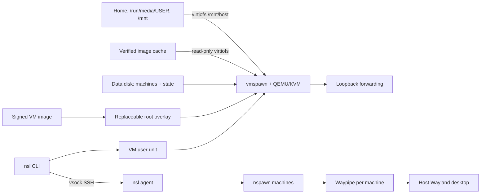

# How nsl works

nsl runs one VM for all your machines, and one more for each isolated machine. Machines are systemd-nspawn containers inside it. The host requires no daemon of its own: only user units bound to the VM, started and stopped with it.

## The VM

The shared VM boots the signed nsl VM image with systemd-vmspawn and QEMU/KVM, under a user unit named `nsl-UID-vm-ID.service`. It has two disks:

- **The root**, a qcow2 overlay on the cached VM image. It holds no user state, so `nsl update` and `nsl recover` simply replace it at the next start.
- **The data disk**, a qcow2 image with a btrfs filesystem. It holds every machine and the VM's own state: its identity, its SSH host keys and the machine records.

The VM starts on first use and stops itself when idle. Its memory and CPUs come from [`nsl.conf`](../reference/configuration.md): by default half the host's memory and every host CPU, as in WSL. Because machines are containers, they share that budget instead of each reserving memory.

Launching doesn't need root. nsl opens `/dev/kvm` and `/dev/vhost-vsock` through your existing `kvm` membership, inside an unprivileged user namespace, and passes them to vmspawn. `nsl` doesn't change host permissions, groups, packages or sudoers.

## Machines

Each machine is a btrfs subvolume on the data disk, created from a signed machine image and run by systemd-nspawn. Machines use the VM's kernel, network namespace and resolver. In the shared VM they also bind `/mnt/host`, your host's shared files.

Creation needs no network once the images are cached. The VM imports the image from the read-only cache and applies only per-machine data: time zone, hostname, account, `sudo` rule and nspawn settings. Everything distro-specific is built into the image, so the host and the VM stay distribution-neutral.

## The agent

The CLI reaches the VM over SSH on vsock, where the VM's sshd accepts only nsl's key and only runs the nsl agent. Before doing anything, the CLI checks the VM's identity: its ID, your UID and GID, its role, and the image's protocol and architecture. It checks this even when the VM was already running.

The agent runs each command as a transient systemd unit in the machine, with a PAM login session. It passes arguments literally, keeps streams separate or uses a terminal, and returns the exit status, with 128+N for a command killed by signal N.

## Host integration

| Mechanism            | How                                                                                     |
| -------------------- | --------------------------------------------------------------------------------------- |
| Files at `/mnt/host` | virtiofs shares, run as your user                                                       |
| Ports                | A forwarder unit per VM, `nsl-UID-vm-ID-ports.service`, polling the agent once a second |
| Windows              | A desktop unit per machine, running Waypipe between the host and the machine            |
| Links and files      | A per-machine broker, reached by `nsl-open` over Varlink                                |
| Editors              | `nsl _ssh NAME`, which runs `sshd -i` in the machine through the agent                  |

## Idle stop

The VM makes both idle decisions, so the host needs no background process. A machine with no nsl sessions, windows or recent requests stops after `idle_timeout`. The VM powers off 60 seconds after its last machine stops and its last request ends. A command that arrives as the VM powers off waits for it to stop, then starts it again.

## Isolated machines

An isolated machine gets its own VM from the same image and launcher, created and removed with the machine. That VM has no shares, no desktop session and no broker, and runs no other machine. See [isolated machines](../guides/isolated.md).

## Design documents

These pages describe nsl for its users. The contracts and decisions behind it live in the repository: the [architecture overview ↗](https://github.com/frostyard/nsl/blob/main/docs/design/lifecycle.md), the [CLI contract ↗](https://github.com/frostyard/nsl/blob/main/docs/specs/cli.md) and the [decision records ↗](https://github.com/frostyard/nsl/tree/main/docs/adr).
